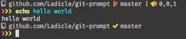

# Git Prompt

Show git status for my fish prompt!
(required Nard-Font)



## fish sample prompt

```
function prompt_git_pwd
  echo (pwd | sed "s:^$GOPATH/src/: :" | sed "s:^$HOME: ~:")
end

function fish_prompt
  if [ $status -eq 0 ]
    set -x cursor (set_color red)"❯"(set_color yellow)"❯"(set_color green)"❯ "
  else
    set -x cursor (set_color red)"❯"(set_color red)"❯"(set_color red)"❯ "
  end

  set -x gs (string split " " (git-prompt))
  set -x lgs (count $gs)
  if [ $lgs -eq 0 ]
      set -x git ""
  else
      switch $gs[1]
          case 0
              set -x icon (set_color yellow)""
          case 1
              set -x icon (set_color red)""
          case 2
              set -x icon (set_color blue)""
          case 3
              set -x icon (set_color blue)""
          case 4
              set -x icon (set_color green)""
      end
      if [ $gs[2] = "master" ]
          set -x branch (set_color -u white)$gs[2](set_color normal)
      else
          set -x branch (set_color normal)$gs[2]
      end
      if [ (count $gs) -eq 3 ]
          set -x git " "$icon" "(set_color white)$branch(set_color yellow)" |  "(set_color white)""$gs[3]""
      else
          set -x git " "$icon" "(set_color white)$branch
      end
  end

  # set -l time (set_color yellow)(date "+(%H:%M:%S)")
  set -l dir (set_color white)(prompt_git_pwd)

  echo $dir$git
  echo $cursor
end
```

## Status

non git repository

```
 
```

all clean 

```
 branch 
```

conflicted!

```
 hash
```

you need to push.

```
 branch
```

you need to rebase!

```
 branch
```

you have not committed changes.

```
 branch |  x,y,z
```
